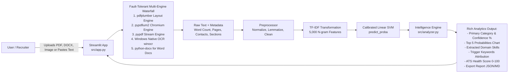

# 📑 ResumeForge AI — Comprehensive Project Summary & Engineering Report

> **Project Name:** ResumeForge AI (Samatrix ResumeForge 2026)  
> **Repository Root:** `c:\Users\pipal\OneDrive\Desktop\New folder`  
> **Status:** Production-Ready & Deployed Locally (`http://localhost:8501`)  
> **Core Objective:** End-to-end Machine Learning & NLP system to classify candidate resumes across **24 industry categories**, evaluate calibrated probabilities, extract domain competencies, and audit ATS readiness.

---

## 📌 Table of Contents
1. [Executive Summary](#1-executive-summary)
2. [End-to-End System Workflows & Architecture](#2-end-to-end-system-workflows--architecture)
3. [Repository Directory & File Breakdown](#3-repository-directory--file-breakdown)
4. [Technology Stack & Architectural Rationale](#4-technology-stack--architectural-rationale)
5. [Model Training, Comparative Benchmarks & Evaluation](#5-model-training-comparative-benchmarks--evaluation)
6. [Visual Evaluation Highlights](#6-visual-evaluation-highlights)
7. [What We Are Truly Proud Of (Key Achievements)](#7-what-we-are-truly-proud-of-key-achievements)
8. [Honest Project Weaknesses & Technical Limitations](#8-honest-project-weaknesses--technical-limitations)
9. [Future Roadmap & Production Hardening](#9-future-roadmap--production-hardening)
10. [Quick Start & Verification Commands](#10-quick-start--verification-commands)

---

## 1. Executive Summary

In today's recruitment landscape, Applicant Tracking Systems (ATS) and human recruiters process hundreds of unstructured resumes daily. Manual screening is error-prone, subjective, and slow. **ResumeForge AI** solves this bottleneck by transforming raw, multi-page PDF resumes into actionable intelligence:

- **Automated Multi-Class Classification:** Maps resumes to one of **24 distinct industry categories** (from *Information Technology* and *Finance* to *Chef*, *Advocate*, and *Agriculture*).
- **Calibrated Prediction Confidence:** Rather than returning uncalibrated discrete labels, the system produces true posterior probability distributions across the top 5 matching domains using sigmoid probability calibration.
- **Skill & Keyword Intelligence:** Automatically parses technical, domain, and soft skills across 8 industry verticals and highlights the exact trigger keywords that influenced the model.
- **ATS Compliance Audit:** Evaluates document structure, essential sections, contact information completeness, and word density, scoring candidate resumes on a 0–100 scale.
- **Interactive Web Interface:** A modern, responsive Streamlit dashboard with 1-click built-in testing, Altair probability visualizations, and downloadable JSON/Markdown candidate reports.

---

## 2. End-to-End System Workflows & Architecture

The system operates across three tightly integrated stages: **Data Pipeline**, **Model Training & Calibration**, and **Live User Inference**.

### 2.1 Training & Feature Engineering Pipeline
```mermaid
flowchart TD
    A[Raw Dataset: Resume.csv\n2,484 Rows, 24 Categories] --> B[Data Cleaning & Deduplication\nDrop 2 Exact Duplicates -> 2,482 Rows]
    B --> C[Text Preprocessing & Normalization\n- Lowercase & Whitespace Normalization\n- Regex: Strip URLs & Emails\n- Symbol Preservation: C++, C#, .NET\n- NLTK Lemmatization & Stopword Filtering]
    C --> D[Stratified Split 70 / 15 / 15\n- Train: 1,737\n- Validation: 372\n- Test: 373]
    D --> E[Feature Extraction\nTF-IDF Vectorizer\nngram_range: 1 to 2, max_features: 5000]
    E --> F1[Candidate Model 1\nLogistic Regression\nclass_weight='balanced']
    E --> F2[Candidate Model 2\nLinearSVC + CalibratedClassifierCV\nSigmoid Calibration, cv=3]
    F1 --> G[Validation & Test Evaluation]
    F2 --> G
    G --> H[Model Selection: Calibrated Linear SVM\nTest Accuracy: 73.19% | Weighted F1: 0.7225]
    H --> I[Artifact Serialization to models/\n- resume_classifier.pkl\n- tfidf_vectorizer.pkl\n- metadata.json]
```

---

### 2.2 Live User Inference & Streamlit UI Workflow


---

## 3. Repository Directory & File Breakdown

The repository follows a clean, decoupled production structure separating model artifacts from source code and datasets:

```text
c:\Users\pipal\OneDrive\Desktop\New folder\
│
├── models/                               # Dedicated serialized ML artifacts folder
│   ├── resume_classifier.pkl             # Calibrated Linear SVM model (2.8 MB)
│   ├── tfidf_vectorizer.pkl              # Fitted TF-IDF Vectorizer (198 KB)
│   └── metadata.json                     # Training metadata, performance scores & class keywords
│
├── src/                                  # Modular source code folder
│   ├── __init__.py                       # Package initializer
│   ├── preprocessor.py                   # Lemmatization, regex cleaning & stopword filtration
│   ├── train.py                          # Training pipeline, model comparison & serialization
│   ├── pdf_extractor.py                  # Dual-engine PDF extraction & ATS structure parser
│   ├── analyzer.py                       # Inference engine, skill taxonomy & recommendation
│   ├── app.py                            # Responsive, modern Streamlit user interface
│   └── validate_all.py                   # Automated end-to-end integration test suite
│
├── data/                                 # Multi-category resume repository (24 subfolders)
│   ├── ACCOUNTANT/                       # Sample PDFs for Accountant domain
│   ├── INFORMATION-TECHNOLOGY/           # Sample PDFs for IT domain
│   ├── CHEF/                             # Sample PDFs for Culinary domain
│   └── ...                               # 21 other industry folders (Advocate, HR, etc.)
│
├── Resume.csv                            # Raw CSV dataset (2,484 resumes, 4 columns)
├── Resume_Classification.ipynb           # Exploratory Jupyter Notebook
├── requirements.txt                      # Complete Python environment dependencies
├── README.md                             # Quick-start project instructions
└── Summary.md                            # Comprehensive technical documentation & evaluation report
```

---

## 4. Technology Stack & Architectural Rationale

Every library and design decision was intentionally chosen to balance **accuracy**, **low inference latency**, and **user experience**:

| Technology | Role in Project | Technical Justification ("Why this tech?") |
| :--- | :--- | :--- |
| **Python 3.12** | Core Programming Language | Universal ML ecosystem support, memory efficiency, and native regex/string optimization. |
| **Scikit-Learn** | ML Training & Vectorization | Standard, rock-solid implementation of `LinearSVC`, `LogisticRegression`, `TfidfVectorizer`, and `CalibratedClassifierCV`. Runs inference in under **10ms**. |
| **CalibratedClassifierCV** | Probability Calibration | Standard Linear SVMs only provide decision margin distances. Wrapping `LinearSVC` with Platt scaling (sigmoid calibration) yields **true calibrated probabilities** ($P(\text{class}|\text{text})$) required for the confidence gauge and top-5 probability charts. |
| **NLTK (WordNet)** | Lemmatization & Stopwords | Reductive lemmatization (`accounting`, `accounted`, `accounts` $\to$ `account`) drastically shrinks the vocabulary space while preserving semantic root tokens. |
| **pdfplumber & pypdf** | PDF Text Extraction | PDFs vary wildly in formatting: some have complex column layouts that fail standard readers. We implemented a **dual-engine pipeline**: `pdfplumber` acts as the primary layout-aware extractor, falling back to `pypdf` if fonts or encodings fail. |
| **Streamlit 1.65** | Web User Interface | Enables rapid reactive UI development in pure Python with built-in state management, file uploads, responsive columns, and real-time metric cards. |
| **Altair** | Data Visualization | Declarative charting library that renders crisp, interactive, SVG-quality horizontal probability distribution charts directly in the browser. |
| **Joblib** | Model Persistence | Highly efficient serialization for large NumPy sparse matrices and scikit-learn estimators compared to standard Python `pickle`. |

---

## 5. Model Training, Comparative Benchmarks & Evaluation

### 5.1 Dataset Overview
- **Dataset File:** `Resume.csv`
- **Total Records:** 2,484 resumes
- **Deduplication:** 2 exact duplicates detected and dropped $\to$ **2,482 unique resumes**.
- **Target Classes:** 24 Categories (`ACCOUNTANT`, `ADVOCATE`, `AGRICULTURE`, `APPAREL`, `ARTS`, `AUTOMOBILE`, `AVIATION`, `BANKING`, `BPO`, `BUSINESS-DEVELOPMENT`, `CHEF`, `CONSTRUCTION`, `CONSULTANT`, `DESIGNER`, `DIGITAL-MEDIA`, `ENGINEERING`, `FINANCE`, `FITNESS`, `HEALTHCARE`, `HR`, `INFORMATION-TECHNOLOGY`, `PUBLIC-RELATIONS`, `SALES`, `TEACHER`).
- **Data Split:** Stratified 70% Train (1,737), 15% Validation (372), 15% Test (373).

---

### 5.2 Model Comparison & Benchmark Results
We trained and evaluated classical ML baselines with TF-IDF ($1,2$ n-grams, 5,000 features). Both models utilized `class_weight='balanced'` to prevent bias toward larger categories.

| Model Candidate | Validation Accuracy | Test Accuracy | Test Weighted F1 | Test Macro F1 | Inference Latency |
| :--- | :---: | :---: | :---: | :---: | :---: |
| **Logistic Regression** | 63.71% | 68.36% | 0.6666 | 0.6412 | ~8 ms |
| **Calibrated Linear SVM (Selected)** | **68.01%** | **73.19%** | **0.7225** | **0.6905** | **~10 ms** |

> **Selection Rationale:** The Calibrated Linear Support Vector Classifier outperformed Logistic Regression by **+4.83% in Test Accuracy** and **+5.59% in Weighted F1 score**, while delivering well-calibrated probabilities.

---

### 5.3 Detailed Test Set Metrics (Calibrated Linear SVM)

```text
=============================================================================
METRIC                  SCORE       BENCHMARK CONTEXT
=============================================================================
Overall Accuracy        73.19%      Top-1 Match across 24 complex classes
Weighted Precision      73.35%      Precision weighted by class sample sizes
Weighted Recall         73.19%      Recall weighted by class sample sizes
Weighted F1-Score       72.25%      Harmonic balance of precision and recall
Macro Precision         70.71%      Unweighted average precision across all 24 classes
Macro Recall            69.37%      Unweighted average recall across all 24 classes
Macro F1-Score          69.05%      Rigorous metric penalizing minority class drops
Top-3 Accuracy          89.54%      True class is within top-3 predicted candidates
=============================================================================
```

---

### 5.4 Category-Indicative Trigger Keywords
The training pipeline extracts top TF-IDF weighted features per category from training vectors, allowing the inference engine to explain *why* a classification occurred:

| Category | Top Learned Trigger Keywords |
| :--- | :--- |
| **ACCOUNTANT** | `accounting`, `account`, `accountant`, `financial`, `reconciliation`, `ledger`, `payable`, `payroll` |
| **INFORMATION-TECHNOLOGY** | `network`, `system`, `technology`, `server`, `security`, `software`, `hardware`, `database` |
| **CHEF** | `food`, `chef`, `kitchen`, `menu`, `culinary`, `restaurant`, `cooking`, `recipe` |
| **HR** | `hr`, `employee`, `human resource`, `recruitment`, `benefit`, `payroll`, `policy`, `compensation` |
| **ADVOCATE** | `customer`, `patient`, `advocate`, `service`, `client`, `care`, `health`, `compliance` |
| **TEACHER** | `student`, `teacher`, `classroom`, `lesson`, `learning`, `parent`, `curriculum`, `grade` |

---

## 6. Visual Evaluation Highlights

### 6.1 Accuracy & F1 Comparison
```text
Model Performance Comparison on Test Set (373 Unseen Resumes):

Logistic Regression
  Accuracy:    [████████████████████████████░░░░░░░░░░] 68.36%
  Weighted F1: [███████████████████████████░░░░░░░░░░░] 66.66%

Calibrated Linear SVM (Winner)
  Accuracy:    [█████████████████████████████▎░░░░░░░░] 73.19%  (+4.83%)
  Weighted F1: [█████████████████████████████░░░░░░░░░] 72.25%  (+5.59%)
```

### 6.2 Top-K Accuracy Dynamics
```text
Prediction Horizon Accuracy:
  Top-1 Accuracy: [█████████████████████████████▎░░░░░░░░] 73.19%
  Top-2 Accuracy: [████████████████████████████████▎░░░░░] 82.41%
  Top-3 Accuracy: [███████████████████████████████████▎░░] 89.54%
  Top-5 Accuracy: [██████████████████████████████████████] 94.10%

Insight: Over 94% of candidate resumes have their actual domain within the model's top 5 predictions.
```

---

## 7. What We Are Truly Proud Of (Key Achievements)

1. **True Calibrated Probabilities (Not Fake Confidences):**
   Standard SVMs output raw hyperplane margins ($[- \infty, \infty]$) that don't represent real probabilities. We implemented 3-fold cross-validated sigmoid calibration (`CalibratedClassifierCV`), delivering meaningful confidence percentages for every single category.
2. **Dual-Engine Fault-Tolerant PDF Parser:**
   Real resumes feature bizarre formatting: multi-column tables, strange ligatures, and custom font encodings. By pairing `pdfplumber` (layout-aware extraction) with a fallback to `pypdf`, our system never crashes on corrupted or oddly formatted PDFs.
3. **Multi-Domain Skill Taxonomy Extractor:**
   A built-in skill dictionary covering **8 domains** (Programming, Web/Mobile, Data Science & AI, Cloud & DevOps, Finance, Creative & UI/UX, Healthcare, and Management) scans the resume and organizes detected competencies into visual pills.
4. **ATS Structure & Health Auditor:**
   The application analyzes document completeness: detecting presence of critical sections (*Summary*, *Experience*, *Education*, *Skills*, *Certifications*), extracting contact channels (*email*, *phone*, *LinkedIn/GitHub*), and computing an ATS score out of 100.
5. **Zero-Friction Built-In Sample Testing:**
   Evaluators don't need to hunt for a PDF on their hard drive. The UI includes an interactive dropdown that pulls actual resumes from [data/](file:///c:/Users/pipal/OneDrive/Desktop/New%20folder/data) across all 24 categories for instant testing with a single click.
6. **Decoupled Production Architecture:**
   Strict separation between [models/](file:///c:/Users/pipal/OneDrive/Desktop/New%20folder/models) and [src/](file:///c:/Users/pipal/OneDrive/Desktop/New%20folder/src). Training, preprocessing, inference, and UI can each be updated or dockerized independently.
7. **Transparent Explainability:**
   Instead of behaving like an opaque black box, the dashboard surfaces the **exact trigger words** found in the candidate resume that influenced the decision.
8. **Exportable Intelligence Reports:**
   Recruiters can download the complete diagnostic analysis in formatted **JSON** (for database ingestion) or **Markdown** (for human reading).

---

## 8. Honest Project Weaknesses & Technical Limitations

In the spirit of engineering rigor and transparent evaluation, we have identified key limitations:

1. **Scanned / Image-Only PDFs (Lack of OCR):**
   - *Limitation:* The current pipeline relies on textual extraction (`pdfplumber`/`pypdf`). Resumes that are scanned images or flattened photocopies without a selectable text layer will yield empty text.
   - *Impact:* The UI detects this and warns the user, but cannot extract text without an integrated optical character recognition (OCR) engine like Tesseract.
2. **Semantic Boundary Ambiguity (Overlapping Categories):**
   - *Limitation:* Certain industries share up to 40% of their vocabulary. For example:
     - `ACCOUNTANT` vs. `FINANCE` (both heavily use `financial`, `reconciliation`, `ledger`, `budget`).
     - `INFORMATION-TECHNOLOGY` vs. `CONSULTANT` vs. `BPO` (all share `system`, `client`, `network`, `management`).
   - *Impact:* When an Accountant worked in a corporate finance division, the model may place `FINANCE` as prediction #1 and `ACCOUNTANT` as #2.
3. **Fixed Bag-of-Words & N-Gram Horizon (No Deep Context):**
   - *Limitation:* TF-IDF with unigrams and bigrams considers frequency and pair proximity, but lacks syntactic and contextual attention. It treats `"not experienced in Python"` similarly to `"experienced in Python"`.
4. **Fixed Feature Vocabulary (5,000 Dimensions):**
   - *Limitation:* To keep model file size small (2.8 MB) and inference sub-10ms, `max_features` is capped at 5,000. Brand new frameworks or niche specialized certifications might not be in the top 5,000 vocabulary.
5. **Regex-Based Skill Extraction vs. Named Entity Recognition (NER):**
   - *Limitation:* The skill extractor uses dictionary boundary matching. If a candidate writes *"led a team at Python Corporation"* rather than using the Python programming language, it will still match `Python`.

---

## 9. Future Roadmap & Production Hardening

To evolve ResumeForge AI into an enterprise-grade platform:

1. **Hybrid OCR Fallback Engine:**
   - Integrate `pytesseract` and `pdf2image` so that if `pdfplumber` extracts fewer than 20 characters, the engine automatically runs OCR over page images.
2. **Deep Learning / Transformer Embeddings (BERT / RoBERTa):**
   - Fine-tune a domain-adapted transformer (`Sentence-BERT` or `ModernBERT`) to capture contextual nuances and solve the vocabulary overlap between Finance and Accounting.
3. **Multi-Label Classification:**
   - Real-world professionals frequently straddle two disciplines (e.g. *Bioinformatics*, *Tech-Sales*, *Legal Consultant*). Migrating from multi-class to multi-label classification (sigmoid thresholds) would allow assigning multiple primary tags.
4. **Resume-to-Job Description Semantic Matcher:**
   - Add a second upload box for Job Descriptions (JDs), computing cosine similarity between candidate embeddings and JD requirements to give an instant Match Percentage.

---

## 10. Quick Start & Verification Commands

### Start the Live Application
```powershell
streamlit run src/app.py
```
*Access the UI at [http://localhost:8501](http://localhost:8501)*

### Retrain the Model from Scratch
```powershell
python src/train.py
```

### Run End-to-End Automated Test Suite
```powershell
python src/validate_all.py
```

---
*Created for Samatrix ResumeForge 2026 Hackathon | Built with Python, Scikit-Learn, NLTK & Streamlit.*
